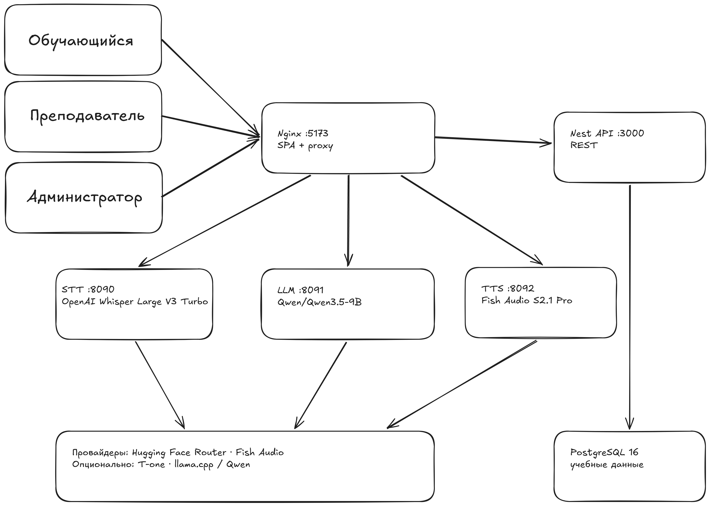

# sys112-trainer

Учебный тренажёр оператора Системы-112. Проект моделирует полный цикл работы с обращением: приём вызова, уточнение обстоятельств, заполнение карточки происшествия, передачу сведений дежурно-диспетчерским службам (ДДС), разбор результата и сопровождение преподавателем.

> **Статус:** демонстрационный прототип для учебного контура. Он не подключается к реальной инфраструктуре Системы-112, не обрабатывает реальные вызовы и не предназначен для эксплуатации в критической среде.

## Материалы для эксперта

| Материал | Где посмотреть |
| --- | --- |
| Документация для оценки | [Единая страница проекта](docs/submission-guide.md) |
| Архитектура | [Описание и схема](docs/architecture.md) |
| API | [Справочник интерфейсов](docs/api.md) |
| Локальный запуск | [Быстрый старт](#быстрый-старт) |
| Презентация | Ссылка будет добавлена командой перед сдачей |
| Работающий прототип | Ссылка будет добавлена командой перед сдачей |
| Видеодемонстрация | Ссылка будет добавлена командой перед сдачей |

Перед отправкой на хакатон замените три последних пункта публичными ссылками и проверьте доступ в режиме инкогнито. Полный чек-лист — в [документации для оценки](docs/submission-guide.md#чек-лист-перед-сдачей).

## Что реализовано

- **Тренировка оператора:** браузерный звонок, распознавание речи, диалог с виртуальным заявителем, синтез речи, карточка происшествия и итоговый разбор.
- **АРМ-112 и ДДС:** работа с адресом, описанием, классификатором, опросником и передачей данных профильным службам.
- **Контур преподавателя:** назначение сценариев, запуск занятия, наблюдение за прогрессом, подсказки и экспертный комментарий.
- **Контур администратора:** управление учебными учётными записями, аудит, проверка сервисов и создание снимка данных.
- **Локальная инфраструктура:** запуск стенда одной командой Docker Compose; сервисы API, STT, LLM, TTS и PostgreSQL изолированы в контейнерах.

## Быстрый старт

### Что потребуется

- Docker Desktop с поддержкой Docker Compose;
- свободные порты `5173`, `3000`, `8080`, `8090`, `8091`, `8092`;
- стабильное подключение к интернету для первого запуска: будут скачаны контейнерные образы и локальные модели.

Рекомендуется не менее 8 ГБ оперативной памяти. Первый запуск может занять больше времени, чем последующие: модели сохраняются в каталоге `models/`, а данные PostgreSQL — в Docker volume `sys112-pgdata`.

Для голосового ответа заявителя в текущей Docker-конфигурации добавьте `FISH_API_KEY` в локальный файл `.env` (не коммитьте его). Без ключа интерфейс и текстовый диалог остаются доступны, но TTS будет работать в деградированном режиме.

```powershell
git clone https://github.com/qwasxxx/112hack.git
cd 112hack
docker compose up --build
```

После запуска откройте <http://localhost:5173>.

| Роль | Логин | Пароль |
| --- | --- | --- |
| Студент | `smirnova` | `112` |
| Преподаватель | `petrov` | `112` |
| Администратор | `volkova` | `112` |

Минимальная проверка работоспособности:

```powershell
Invoke-WebRequest http://localhost:3000/api/v1/health
Invoke-WebRequest http://localhost:8090/health
Invoke-WebRequest http://localhost:8091/health
Invoke-WebRequest http://localhost:8092/health
```

Для остановки стенда:

```powershell
docker compose down
```

Не добавляйте флаг `-v`, если хотите сохранить учебные данные. Подробная диагностика и альтернативный запуск для разработки — в [docs/development.md](docs/development.md).

## Демонстрация за 5 минут

1. Откройте две вкладки с `http://localhost:5173`.
2. Войдите как `petrov` в первой вкладке и как `smirnova` — во второй.
3. Преподаватель назначает билет и запускает занятие.
4. Студент открывает назначенный сценарий, принимает вызов, разрешает доступ к микрофону и заполняет карточку.
5. Преподаватель наблюдает прогресс и при необходимости отправляет подсказку.
6. После завершения звонка проверьте разбор, запись занятия и итоговый комментарий.

Полный маршрут, альтернативные ветки и ожидаемое поведение описаны в [пользовательских потоках](docs/user-flows.md).

## Технологии

| Область | Используемые технологии |
| --- | --- |
| Веб-интерфейс | React, TypeScript, Vite |
| Серверное API | NestJS, TypeScript |
| Распознавание речи | FastAPI, Python; T-one или Hugging Face STT в зависимости от конфигурации |
| Диалоговый движок | FastAPI, Python, llama.cpp/Qwen или Hugging Face-совместимый провайдер |
| Синтез речи | FastAPI, Python; Fish Audio или локальный движок в зависимости от конфигурации |
| Данные | PostgreSQL, SQL-миграции |
| Развёртывание | Docker Compose, Nginx |

Конфигурация провайдеров хранится в `.env`; секреты и ключи нельзя добавлять в репозиторий. Для текущего Docker-режима Fish Audio нужен `FISH_API_KEY`; актуальные параметры среды приведены в [.env.example](.env.example).

## Архитектура



Исходник схемы Excalidraw: [architecture-current.excalidraw](docs/assets/architecture-current.excalidraw). Векторный вариант: [architecture-current.svg](docs/assets/architecture-current.svg).

Браузер обращается к одному локальному адресу, а Nginx маршрутизирует REST- и WebSocket-запросы к API и голосовым сервисам. PostgreSQL хранит учебные данные. Компоненты, потоки данных, границы доверия и развёртывание описаны в [архитектурной документации](docs/architecture.md).

## Структура репозитория

```text
apps/       веб-интерфейсы, API и сервисы STT/LLM/TTS
packages/   общие типы, API-клиент и UI-примитивы
infra/      Docker, Nginx и миграции базы данных
docs/       продуктовая, техническая и эксплуатационная документация
scripts/    сценарии локального запуска
```

## Документация

| Документ | Содержание |
| --- | --- |
| [Документация для эксперта](docs/submission-guide.md) | Краткое описание решения, запуск и маршрут проверки |
| [Продукт](docs/product.md) | Пользователи, ценность, сценарии и границы |
| [Архитектура](docs/architecture.md) | Контекст, контейнеры, потоки и развёртывание |
| [Интерфейсы API](docs/api.md) | HTTP- и WebSocket-контракты |
| [Данные](docs/data.md) | Сущности, хранение и миграции |
| [Разработка](docs/development.md) | Детальный локальный запуск и диагностика |
| [Эксплуатация](docs/operations.md) | Health-check, backup и инциденты |
| [Тестирование](docs/testing.md) | Проверки и их состояние |
| [Безопасность](docs/security.md) | Границы доверия, меры и риски |
| [Ограничения](docs/limitations.md) | Технический долг и дальнейшие шаги |

## Ограничения и ответственное использование

Проект — учебный прототип. В нём отсутствуют интеграция с АТС/SIP и реальными ДДС, промышленная авторизация API, HTTPS, доказанная нагрузочная устойчивость и формальная OpenAPI-спецификация. При отказе TTS текстовый диалог может продолжаться, но это считается деградированным режимом. Детали без скрытия рисков — в [ограничениях](docs/limitations.md) и [документе по безопасности](docs/security.md).

## Локальная разработка

Для запуска без полного Docker-стенда нужны Node.js 20.11+, pnpm 10.33.1, Python 3.11 и Docker для PostgreSQL. Команды и порядок запуска приведены в [docs/development.md](docs/development.md).
