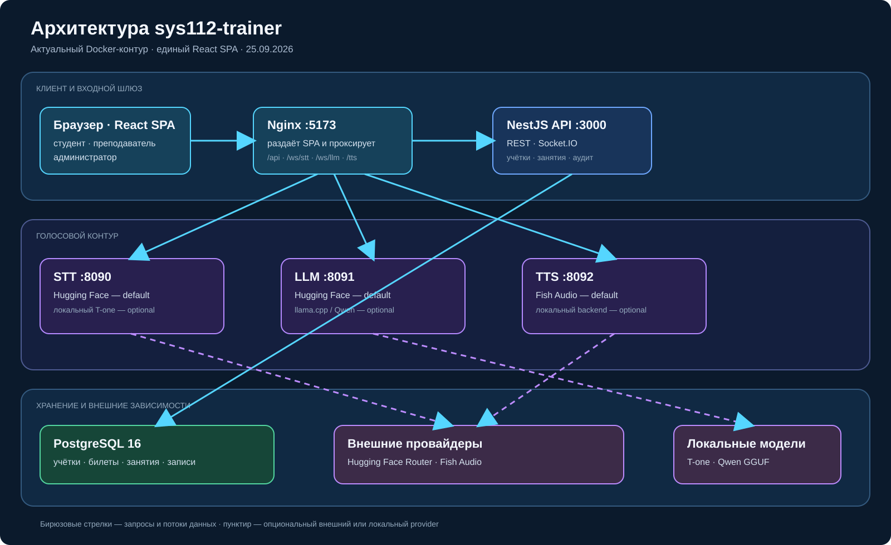
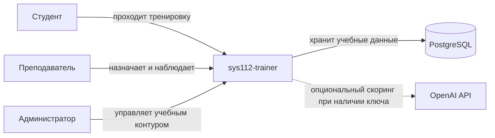
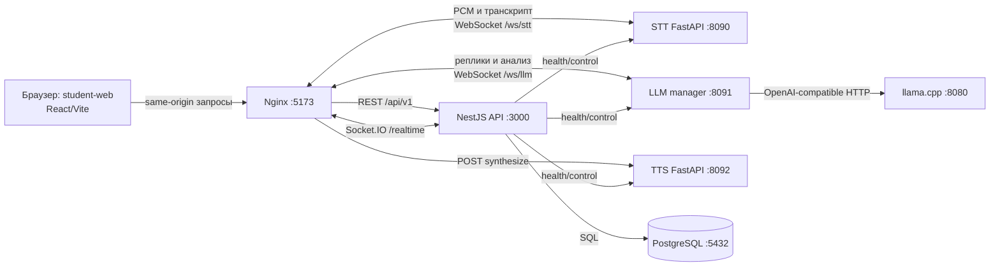
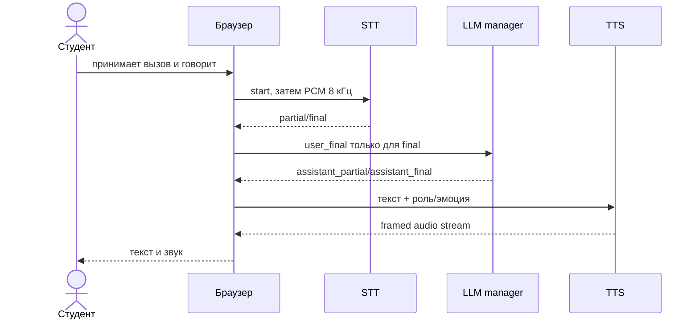

# Архитектура системы

**Назначение документа.** Передать разработчикам и архитекторам фактическую структуру прототипа. Разделы адаптированы из arc42, схемы используют уровни C4: контекст и контейнеры.

## Архитектура одним изображением

Редактируемый исходник схемы: [`assets/architecture-current.excalidraw`](assets/architecture-current.excalidraw).

Изображение для отдельного прикрепления к материалам хакатона: [`assets/system-architecture.png`](assets/system-architecture.png). Редактируемый векторный оригинал: [`assets/system-architecture.svg`](assets/system-architecture.svg).

На изображении показан основной runtime-путь. Одноразовый контейнер `models`, который загружает файлы T-one и Qwen перед стартом зависимых сервисов, не включён в рабочий поток, чтобы схема не смешивала подготовку стенда с обработкой запроса.

## Контекст

Сплошная стрелка означает обязательное взаимодействие текущего локального контура. Пунктирная — опциональную внешнюю зависимость. Реальные АТС и ДДС на схеме отсутствуют, потому что продукт их только имитирует.

## Контейнеры

Каждый блок — отдельный процесс или браузер. Стрелки подписаны протоколом и назначением. Браузер обращается к одному origin `:5173`; Nginx маршрутизирует REST и WebSocket к контейнерам. В Docker наружу также опубликованы диагностические порты `3000`, `8080`, `8090`, `8091`, `8092`; PostgreSQL доступен только внутри compose-сети. Основание: `infra/docker/docker-compose.yml`, `infra/docker/nginx.conf`.

## Ответственность компонентов

| Компонент | Фактическая ответственность | Источник |
| --- | --- | --- |
| `student-web` | все три ролевых интерфейса, локальное состояние и аудио; через same-origin proxy вызывает API, STT, LLM и TTS | `src/app.tsx`, `vite.config.ts`, `nginx.conf` |
| `api` | учётки, учебные записи, назначения, live presence, подсказки, записи аудио, backup, health | контроллеры `apps/api/src` |
| `stt` | PCM 8 кГц → partial/final-транскрипт | `apps/stt/src/sys112_stt/app.py` |
| `llm` | сессия разговора, генерация реплик, разбор и генерация билета | `apps/llm/src/sys112_llm/app.py` |
| `llama` | локальный OpenAI-compatible inference Qwen | compose |
| `tts` | синтез потокового аудио с ролью/эмоцией | `apps/tts/src/sys112_tts/app.py` |
| PostgreSQL | учётки, результаты, назначения, live-состояние, записи и каталог | migrations `0001`–`0006` |

## Основной поток звонка

Partial-текст нужен для интерфейса, но не должен порождать ответ LLM. При завершении UI просит отдельный анализ. Основание: `stt-stream.ts`, `llm-stream.ts`, `apps/llm/tests/test_llm.py`.

Пользовательские переходы до и после этого технического потока приведены в [user-flows.md](user-flows.md).

## Поток данных преподавателя

Браузер студента раз в 1,5 секунды отправляет snapshot присутствия через REST. Интерфейс преподавателя читает список активных студентов и сохраняет подсказки; студент опрашивает их и показывает баннер. Это не Socket.IO-поток, несмотря на наличие realtime gateway. Основание: `student-app.tsx`, `progress/remote.ts`, `teacher-cues.ts`.

## Развёртывание

Основной вариант — один Docker Compose project `sys112` на локальном компьютере. Nginx внутри web-контейнера раздаёт SPA и проксирует API/WS. Состояние БД лежит в именованном volume, модели — в bind mount `./models`, TTS cache — в volume. TLS и внешний ingress не настроены.

## Важные расхождения с прежним обзором

- `docs/architecture/overview.md` описывает два рабочих frontend-контейнера, но compose запускает только `student-web`, который включает все роли.
- Там указан Coqui XTTS-v2, но текущий compose по умолчанию задаёт `TTS_BACKEND=fish`; реализация поддерживает и локальные альтернативные движки через конфигурацию.
- Описание RAG и scenario-engine относится к архитектурному каркасу; пользовательский демонстрационный поток хранится главным образом в `lesson_records`, `live_presence`, `ticket_catalog` и клиентском состоянии.
- ADR 003 «TypeScript everywhere» больше не буквально верен: STT/LLM/TTS реализованы на Python.

Статус решений: [adr/README.md](adr/README.md). Интерфейсы: [api.md](api.md). Данные: [data.md](data.md).
