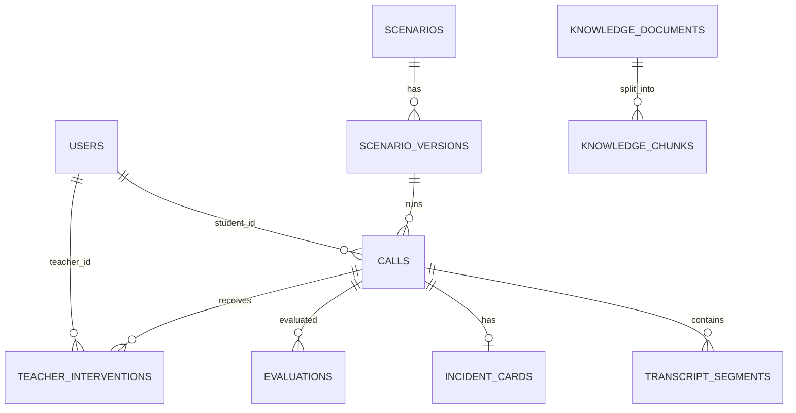

# Данные и хранение

**Назначение документа.** Помочь backend-разработчикам и эксплуатационной команде понять, где живут данные, как меняется схема и что входит в backup.

## Источник истины

SQL-миграции `infra/database/migrations/*.sql` — источник истины. Drizzle-схема `apps/api/src/infrastructure/database/schema/index.ts` отражает преимущественно ранний доменный набор и не содержит всех таблиц миграций `0002`–`0006`.

## Фактически используемые группы

| Группа | Таблицы | Назначение |
| --- | --- | --- |
| Идентификация | `users` | логин, bcrypt-хеш, роль, блокировка |
| Учебный контур | `lesson_records`, `assignments`, `class_state`, `teacher_overlays` | результаты, назначения, активное занятие, экспертный комментарий |
| Наблюдение | `live_presence`, `teacher_cues`, `teacher_audit` | текущий snapshot, подсказки, учебный аудит |
| Медиа и билеты | `call_recordings`, `ticket_catalog` | WAV/другие аудиобайты и изменения каталога |
| Архитектурный каркас | `courses`, `lessons`, `scenarios`, `scenario_versions`, `calls`, `transcript_segments`, `incident_cards`, `teacher_interventions`, `evaluations`, `knowledge_*`, `audit_log`, `training_progress` | модель будущего серверного scenario-engine; используется не всеми UI-потоками |

## Связи

Каждая линия показывает внешний ключ миграции `0001_init.sql`. Более поздние учебные таблицы связываются текстовыми `login`, `lesson_id` и `scenario_id`, а не внешними ключами; это упрощает прототип, но допускает осиротевшие записи.

## Жизненный цикл

1. Миграция `0002` создаёт демо-учётки и начальное назначение.
2. Преподаватель обновляет назначения и состояние занятия через REST.
3. Студент во время работы публикует `live_presence`; запись удаляется при выходе из активного экрана, но аварийное закрытие вкладки может оставить запись до логической фильтрации по времени.
4. Завершённый результат сохраняется в `lesson_records`; аудио — в `call_recordings` с лимитом 32 МБ на запрос.
5. Комментарий преподавателя хранится в `teacher_overlays`.
6. Снимок администратора сериализует пользователей, занятия, назначения, состояние класса, overlays и последние 200 записей teacher audit в JSON.

## Миграции

API запускает миграции из `MIGRATIONS_DIR` через `apps/api/src/infrastructure/database/migrate.ts`; применённые имена фиксируются в `schema_migrations`. Новая миграция должна быть добавочной и идемпотентной там, где это возможно. Не редактируйте уже применённый SQL на стенде — добавляйте следующий номер.

## Согласованность и удаление

- Транзакционные гарантии зависят от отдельных SQL-операций сервиса; распределённой транзакции между браузером, API и голосовыми сервисами нет.
- Client fallback использует IndexedDB/local storage и позже гидратируется с API; возможны расхождения при недоступном API.
- Политика хранения, срок удаления, каскадное удаление пользователя и очистка аудиозаписей не определены.
- Backup JSON не включает `call_recordings.bytes`, `teacher_cues`, полный `audit_log` и архитектурные таблицы `0001`; это не полный backup PostgreSQL.

## Восстановление

Автоматический импорт JSON-снимка отсутствует. Для полного восстановления сейчас нужен backup Docker volume или `pg_dump`/`pg_restore`, но эти команды не автоматизированы проектом. Поэтому кнопку «Создать резервную копию» следует считать экспортом части учебного состояния, а не гарантированным disaster-recovery backup.
