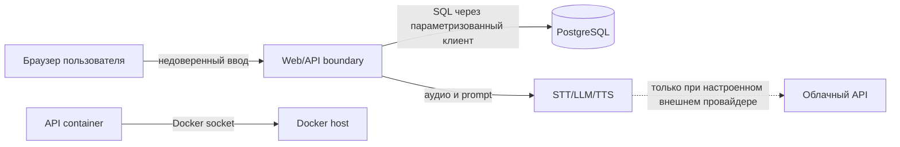

# Безопасность

**Назначение документа.** Зафиксировать границы доверия, действующие меры и риски для разработчиков и владельца стенда. Это анализ прототипа, а не заявление о соответствии требованиям промышленной системы 112.

## Границы доверия

Каждая стрелка пересекает отдельную границу доверия. Особо опасна связь API с Docker socket: компрометация API потенциально даёт управление контейнерами/host. Облачная стрелка пунктирная, потому что базовый Docker-путь локальный.

## Реализованные меры

- Пароли PostgreSQL хешируются `crypt(..., gen_salt('bf'))`; API не возвращает hash.
- Клиентский fallback использует PBKDF2-SHA256 с солью (`auth/password.ts`).
- SQL-запросы используют параметризацию библиотеки `postgres`.
- CORS Nest API ограничивается `CORS_ORIGINS`; модели по умолчанию выполняются локально.
- Запись ограничена 32 МБ после base64 decode.
- `.env` исключён из Git; `.env.example` не содержит реальных ключей.
- Аудитируются часть действий входа, управления пользователями, backup и сервисами.

## Существенные риски

| Риск | Фактическое состояние | Приоритет |
| --- | --- | --- |
| Отсутствие серверной сессии/JWT | login возвращает user, последующие endpoints открыты; `JWT_*` загружаются, но не используются | P0 до любой недоверенной сети |
| Нет role-based access control | любой сетевой клиент может вызвать user/admin/training mutations | P0 |
| Docker socket в API | повышает последствия RCE/SSRF/ошибки control endpoint | P0; убрать или вынести privileged helper |
| Демо-пароль `112` | допустим только на изолированном стенде | P0 перед реальным использованием |
| Открытый CORS в STT/TTS и Socket.IO | `*`/`origin:true` | P1 |
| Нет TLS | трафик, пароли и аудио открыты в локальной сети | P0 перед многомашинным развёртыванием |
| Персональные данные и аудио | политика согласия, срока хранения и удаления не определена | P0 перед реальными данными |
| Prompt injection/нежелательный контент | билет и речь входят в prompt; нет отдельного safety-layer | P1, с учётом учебного контекста |
| Backup неполный и не защищён | JSON содержит данные пользователей, хранится без шифрования | P1 |
| DoS | JSON limit 48 МБ, нет rate limit; тяжёлые LLM/TTS endpoints | P1 |

## Правила эксплуатации сейчас

- Запускайте стенд только на localhost или в доверенной изолированной сети.
- Используйте вымышленные данные и тестовые аудиозаписи.
- Не публикуйте порты `3000`, `8080`, `8090`–`8092` в интернет.
- Не задавайте `HF_TOKEN`, если внешняя передача данных не согласована.
- Перед использованием реальных данных внедрите серверные сессии, RBAC, TLS, журнал доступа, сроки хранения и удаление.

Методика угроз следует OWASP Threat Modeling: активы → границы доверия → угрозы → меры. Здесь не заявлена полнота STRIDE-модели; отдельная сессия моделирования нужна после определения реального развёртывания.
