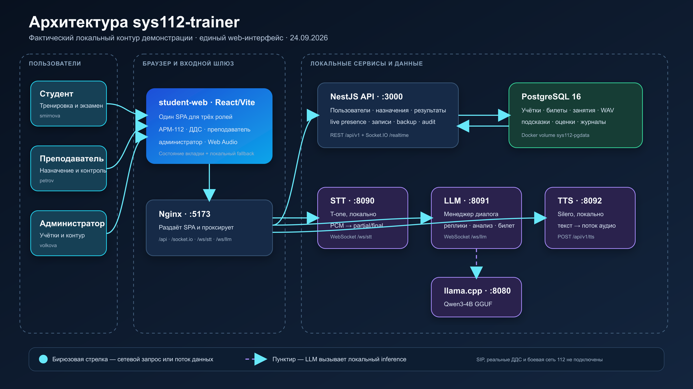

# sys112-trainer: документация для эксперта

## О проекте

`sys112-trainer` — учебный тренажёр оператора Системы-112. Он позволяет отрабатывать приём обращения в безопасном браузерном контуре: вести диалог с виртуальным заявителем, уточнять обстоятельства, заполнять карточку происшествия, передавать сведения ДДС и получать разбор результата.

Проект предназначен для учебного процесса. Он не интегрирован с боевой инфраструктурой 112, АТС, SIP-телефонией и реальными диспетчерскими службами.

## Ценность решения

| Участник обучения | Что получает |
| --- | --- |
| Студент | Практику полного сценария звонка без риска для реальных заявителей |
| Преподаватель | Назначение сценариев, наблюдение, подсказки и итоговая экспертная оценка |
| Администратор | Управление учебными учётными записями, аудит и контроль состояния стенда |

Основные пользовательские сценарии: учебный звонок с STT/LLM/TTS, работа с АРМ-112, передача в ДДС, преподавательское сопровождение и администрирование. Их подробное описание находится в [документе о продукте](product.md) и [пользовательских потоках](user-flows.md).

## Как проверить решение

### Запуск

Нужны Docker Desktop, свободные порты `5173`, `3000`, `8080`, `8090`, `8091`, `8092` и интернет для первоначальной загрузки образов и моделей.

Для голосового ответа заявителя текущая Docker-конфигурация ожидает `FISH_API_KEY` в локальном `.env`. Ключ не добавляется в репозиторий. Без него стенд всё ещё можно проверить в текстовом деградированном режиме, но TTS health-check не будет готов.

```powershell
git clone https://github.com/qwasxxx/112hack.git
cd 112hack
docker compose up --build
```

Откройте <http://localhost:5173>. Для демонстрации доступны учётные записи:

| Роль | Логин | Пароль |
| --- | --- | --- |
| Студент | `smirnova` | `112` |
| Преподаватель | `petrov` | `112` |
| Администратор | `volkova` | `112` |

### Сценарий проверки

1. Войдите в двух вкладках как `petrov` и `smirnova`.
2. В преподавательском интерфейсе назначьте билет и начните занятие.
3. В интерфейсе студента откройте сценарий, разрешите микрофон, примите звонок и заполните карточку происшествия.
4. Убедитесь, что преподаватель видит активность студента и может отправить подсказку.
5. Завершите вызов и проверьте разбор, сохранённый результат и комментарий преподавателя.
6. При необходимости войдите как `volkova`, чтобы проверить статусы сервисов и создать снимок данных.

### Health-check

| Компонент | Адрес проверки |
| --- | --- |
| Web-интерфейс | <http://localhost:5173> |
| API | <http://localhost:3000/api/v1/health> |
| STT | <http://localhost:8090/health> |
| LLM | <http://localhost:8091/health> |
| TTS | <http://localhost:8092/health> |

Если первый запуск занимает много времени, дождитесь завершения загрузки моделей и готовности контейнеров. Инструкции по диагностике — в [руководстве по разработке](development.md) и [эксплуатационном runbook](operations.md).

## Архитектура и стек



| Слой | Технологии и назначение |
| --- | --- |
| Клиент | React, TypeScript, Vite; единый интерфейс для студента, преподавателя и администратора |
| API | NestJS; учётные записи, учебные результаты, назначения, audit, health и backup |
| Голосовой контур | Python/FastAPI: STT, менеджер диалога LLM и TTS |
| Модели | T-one/Hugging Face для STT; Qwen/llama.cpp или Hugging Face-совместимый LLM; Fish Audio или локальный TTS |
| Данные | PostgreSQL, SQL-миграции |
| Инфраструктура | Docker Compose, Nginx, health-checks |

Браузер работает с единым origin. Nginx направляет HTTP- и WebSocket-трафик соответствующим сервисам, PostgreSQL хранит учебное состояние. Детальная схема контейнеров, последовательность звонка, потоки данных и правила развёртывания приведены в [архитектуре](architecture.md).

## API

API доступен по `/api/v1/*`; голосовые сервисы используют HTTP и WebSocket. Полный перечень реальных маршрутов, форматы сообщений и ограничения контракта — в [справочнике API](api.md). Для быстрой проверки доступны `GET /api/v1/health` и `GET /api/v1/ready`.

## Важные ограничения

- Это локальный учебный прототип, не боевой контур Системы-112.
- Нет интеграции с реальными АТС, SIP, ДДС или персональными данными.
- Нет промышленной аутентификации и авторизации API, TLS, доказанного восстановления из резервной копии и подтверждённого нагрузочного теста.
- Голосовые провайдеры и модели зависят от локальной конфигурации; для части режимов могут понадобиться внешние ключи, которые хранятся только в локальном `.env`.

Полная и приоритизированная картина — в [ограничениях](limitations.md), границы доверия — в [безопасности](security.md).

## Материалы в репозитории

- [README](../README.md) — входная точка и быстрый запуск;
- [архитектура](architecture.md) — описание системы и схема;
- [API](api.md) — интерфейсы;
- [эксплуатация](operations.md) — запуск, health-check, backup и инциденты;
- [тестирование](testing.md) — проверка качества;
- [ADR](adr/README.md) — зафиксированные архитектурные решения.

## Чек-лист перед сдачей

- [ ] Репозиторий публичен или у экспертов есть гостевой доступ.
- [ ] В форме сдачи указана ссылка на этот документ или на корневой README.
- [ ] Ссылка на презентацию доступна всем, у кого есть ссылка.
- [ ] Ссылка на прототип или видеодемонстрацию доступна без авторизации.
- [ ] В README заменены пометки «ссылка будет добавлена» на финальные публичные ссылки.
- [ ] Все ссылки проверены в режиме инкогнито.
- [ ] После стоп-кода не изменяются код, документы, презентация и развёрнутый стенд, указанные в форме сдачи.
