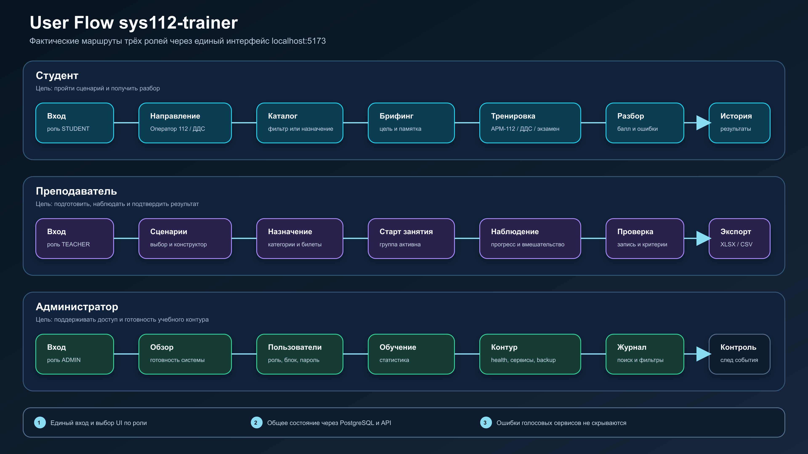
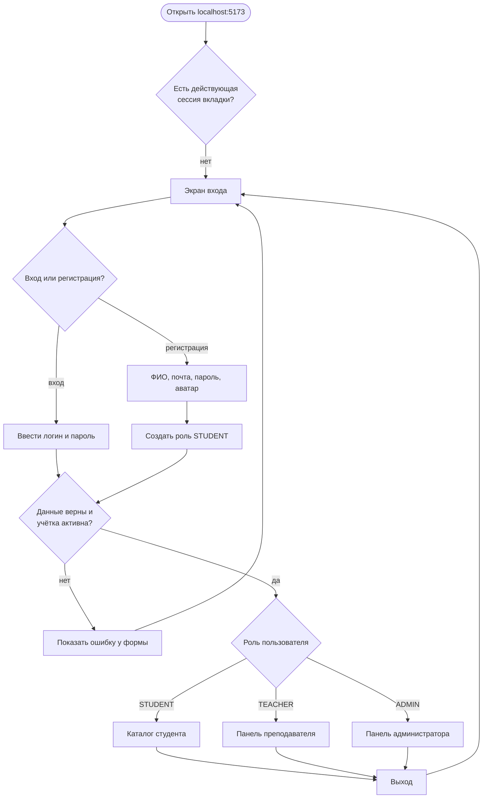
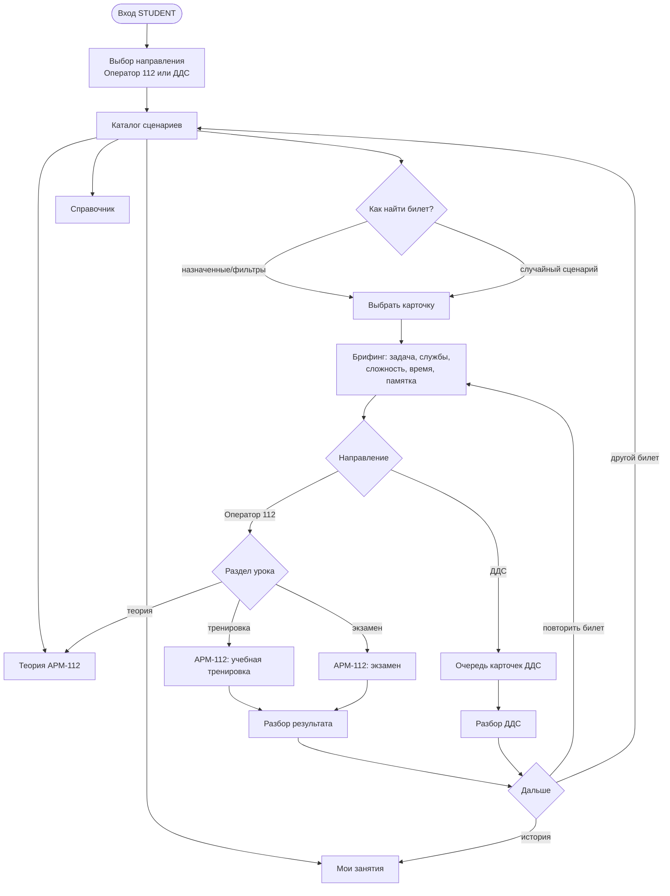
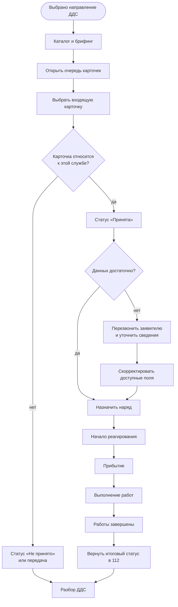
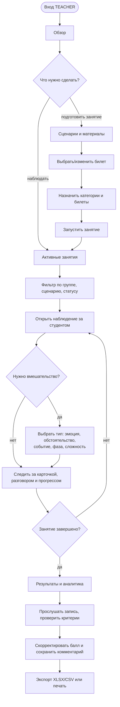
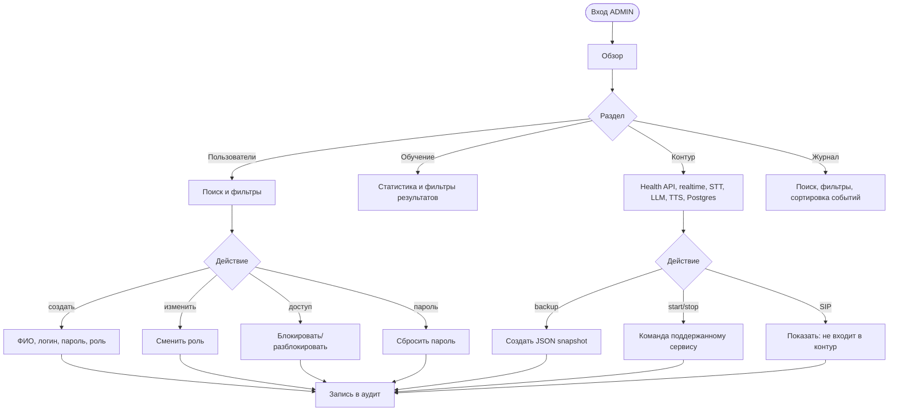
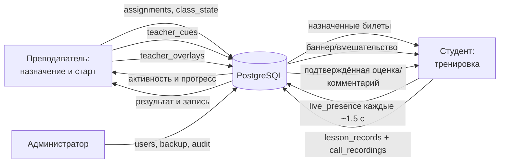

# Пользовательские потоки

**Назначение документа.** Показать экспертам, аналитикам, дизайнерам и разработчикам фактический путь каждого пользователя через текущий продукт: цели, экраны, решения, альтернативные ветки, ошибки и точки сохранения данных.

**Граница описания.** Потоки построены по `apps/student-web/src/app.tsx`, `student-app.tsx`, преподавательской панели из `apps/teacher-web/src/teacher-dashboard`, административному контуру и фактическим API. Они описывают текущее поведение, а не желаемый будущий UX.

## Обзор потоков одним изображением



Файл для отдельного прикрепления: [`assets/user-flow-overview.png`](assets/user-flow-overview.png). Редактируемый векторный оригинал: [`assets/user-flow-overview.svg`](assets/user-flow-overview.svg).

## Общая точка входа и маршрутизация по роли



Сессия хранится для вкладки в `sessionStorage`; учётные данные сначала проверяются через API, при его недоступности возможен локальный fallback. Роль выбирает интерфейс без отдельного URL. Основание: `app.tsx`, `auth/accounts.ts`.

## Основной поток студента

### Цель

Пройти назначенный учебный сценарий и получить понятный разбор своих действий. Основной happy path: вход → направление подготовки → каталог → брифинг → тренировка/экзамен → разбор → история занятий.



### Поток учебного вызова АРМ-112

```mermaid
sequenceDiagram
  actor S as Студент
  participant UI as АРМ-112 в браузере
  participant STT as Распознавание речи
  participant LLM as Виртуальный заявитель
  participant TTS as Озвучка
  participant API as Учебное API/PostgreSQL
  participant P as Преподаватель

  UI->>API: опубликовать присутствие и прогресс
  P->>API: наблюдать активное занятие
  UI-->>S: показать входящий звонок или SMS
  alt Голосовой билет
    S->>UI: принять вызов и разрешить микрофон
    UI->>STT: start + PCM 8 кГц
    STT-->>UI: partial для отображения
    STT-->>UI: final реплика студента
    UI->>LLM: user_final + контекст билета
    LLM-->>UI: assistant_final
    UI->>TTS: текст, роль и эмоция
    TTS-->>UI: поток аудио
    UI-->>S: реплика заявителя текстом и голосом
  else SMS-билет
    UI-->>S: показать текст сообщения без голосового диалога
  end
  S->>UI: заполнить адрес, описание, заявителя, классификатор, опросник и службы
  opt Подсказка преподавателя
    P->>API: отправить вмешательство/подсказку
    API-->>UI: cue
    UI-->>S: показать баннер; при живом звонке изменить поведение заявителя
  end
  S->>UI: завершить обработку
  UI->>API: сохранить результат и запись
  UI-->>S: показать балл, ошибки, рекомендации и статус подтверждения
```

### Решения и исключения студента

| Точка | Ожидаемое поведение | Альтернативная ветка |
| --- | --- | --- |
| Нет назначения | каталог не должен выглядеть пустой ошибкой | объяснить, что преподаватель ещё не назначил билет |
| Микрофон запрещён | показать понятную ошибку и способ разрешить доступ | пользователь возвращается к звонку после изменения permission |
| STT не готов | не имитировать успешную транскрибацию | показать `model_not_ready`, разрешить выйти из сценария |
| LLM загружается | сохранить заполненную карточку и состояние экрана | показать статус загрузки, не создавать дубли реплик |
| TTS недоступен | продолжить диалог текстом | звук считается деградацией, а не блокировкой |
| Повторный partial STT | не отправлять его в LLM | ответ создаётся только по final-фразе |
| Выход во время занятия | вернуться в брифинг | убрать live presence и не выдавать незавершённое занятие за результат |
| Экзамен | не раскрывать эталон до окончания | зачёт отображается от 80 баллов |

## Поток диспетчера ДДС



Службы уже приходят в карточке из 112; пользователь ДДС не должен произвольно добавлять новые. Для связи используется номер в карточке. Основание: `briefing-page.tsx`, `dds-training/*`.

## Поток преподавателя

### Цель

Подготовить занятие, видеть состояние группы, вмешиваться без прямого редактирования ответа студента, проверить результаты и дать обратную связь.



### Состояния преподавательской панели

| Раздел | Задача пользователя | Основные действия |
| --- | --- | --- |
| Обзор | понять готовность группы и системы | начать/остановить занятие, перейти к активному студенту |
| Активные занятия | найти текущую сессию | фильтровать, открыть наблюдение |
| Наблюдение | контролировать ход без подмены студента | видеть карточку/прогресс, применить допустимое вмешательство |
| Сценарии и материалы | подготовить содержание | редактировать/создать билет, импортировать каталог |
| Результаты и аналитика | проверить обучение | фильтры, запись, комментарий, корректировка балла, экспорт |

Если активных занятий нет, вмешательство не отправляется: преподаватель получает сообщение, что студент должен открыть билет. Данные обновляются polling примерно раз в две секунды; индикатор Socket.IO показывает связь, но live presence фактически читается через REST.

## Поток администратора



Критическое ограничение: UI скрывает и блокирует часть опасных действий, но сервер не проверяет роль. Поэтому этот поток безопасен только в доверенном локальном стенде; подробности — [security.md](security.md).

## Сквозной поток данных между ролями



Стрелка обозначает направление записи или чтения. Это логический поток; не каждая связь обеспечена внешним ключом БД.

## UX-принципы текущего продукта

- Пользователь всегда остаётся в своей роли после входа; смена роли администратором требует нового входа.
- Студент сначала получает контекст и цель на брифинге, затем переходит к действию.
- Реалистичность голоса не должна блокировать учебную цель: текст остаётся резервным каналом.
- В экзамене обратная связь откладывается до завершения.
- Преподаватель влияет через ограниченные доменные команды, а не редактирует карточку за студента.
- Состояние внешних сервисов должно называться честно: `loading`, `not_ready`, `degraded`, а не «работает» по факту наличия контейнера.

## Критерии приёмки user flow

1. Каждая роль проходит от входа до своей главной цели без ручного изменения данных в БД.
2. Названия экранов в документации совпадают с интерфейсом.
3. Для каждого блокирующего внешнего сервиса показана понятная ошибка и доступен безопасный выход.
4. Переходы назад не теряют уже сохранённые результаты и не оставляют ложное live presence.
5. Студент, преподаватель и администратор видят согласованное состояние после синхронизации API.
6. Все действия, влияющие на оценку, доступ или инфраструктуру, отражаются в соответствующем журнале.

## Основания

- Маршрутизация ролей: `apps/student-web/src/app.tsx`.
- Экраны студента: `student-app.tsx`, `pages/*`, `features/arm112-simulator`, `features/dds-training`.
- Преподаватель: `teacher/teacher-app.tsx`, `apps/teacher-web/src/teacher-dashboard`.
- Администратор: `admin/admin-app.tsx`, `admin/pages/*`.
- Синхронизация: `progress/remote.ts`, `progress/live-presence.ts`, `progress/teacher-cues.ts`.
- Голос: `lib/stt-stream.ts`, `lib/llm-stream.ts`, `lib/tts-player.ts`.
